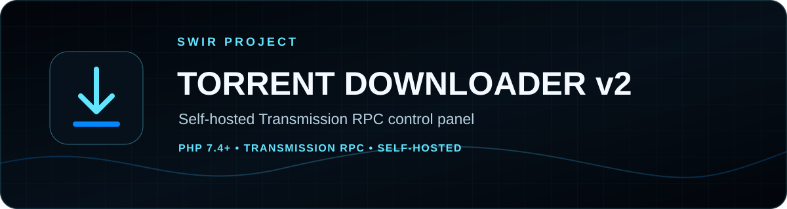
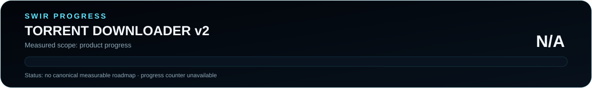

<!-- SWIR-README-STANDARD:v2 -->

<div align="center">



<br>


<br>


[](https://github.com/Swir)
[](https://github.com/Swir/Torrent_downloaderv2/releases)

[**Highlights**](#-highlights) · [**Quick Start**](#%EF%B8%8F-quick-start) · [**Security**](#-deployment-security) · [**Progress**](#%EF%B8%8F-progress)

</div>


## 📍 Project Status



| Item | Status |
|---|---|
| Current stage | Published v1.0.0 line |
| Runtime | PHP 7.4+ |
| Backend | Transmission RPC |
| Latest public release | [v1.0.0](https://github.com/Swir/Torrent_downloaderv2/releases/tag/v1.0.0) |
| Product progress | **N/A** — no canonical measurable product roadmap |

The existing release is real, but a release tag is not converted into a fake product-completion percentage.

## 🚀 Overview

**Torrent Downloader v2** is a self-hosted PHP control layer for a Transmission daemon. The installer prepares the runtime directories, configuration, data files and PHP classes used by the panel, while the application talks to Transmission through its RPC interface.

The repository is intended for systems you administer and content you are legally authorized to transfer.

## ✨ Highlights

| Feature | What it provides |
|---|---|
| 🌊 Transmission RPC | Sends JSON RPC requests to a configured Transmission daemon |
| 🧲 Magnet / torrent add | Uses Transmission's `torrent-add` workflow |
| 🛠️ Installer | Checks PHP/extensions and prepares configuration/runtime directories |
| 📁 Per-user view | Associates panel records with a generated user UUID |
| 📦 ZIP workflow | Tracks completed items and ZIP availability in local application data |
| 🧾 Logging | Writes application events to the configured log directory |
| 📦 Release package | Public deployment ZIP plus SHA-256 checksum |

## ⚙️ Quick Start

### Recommended — release package

Download the latest deployment archive from [GitHub Releases](https://github.com/Swir/Torrent_downloaderv2/releases). The v1.0.0 release contains:

- `Torrent_downloaderv2-v1.0.0.zip`
- `Torrent_downloaderv2-v1.0.0.zip.sha256`

Extract it on a compatible PHP server, then review the generated configuration before exposing the application.

### From source

```bash
git clone https://github.com/Swir/Torrent_downloaderv2.git
cd Torrent_downloaderv2
php install.php
```

The installer requires PHP 7.4+ and checks for:

```text
curl
json
zip
openssl
mbstring
```

It creates the local `data/`, `zips/`, `logs/` and `classes/` directories when they are missing, then prepares a default configuration pointing at the local Transmission RPC endpoint.

## 📋 Requirements / Compatibility

- PHP **7.4+**
- PHP extensions: cURL, JSON, ZIP, OpenSSL and mbstring
- Transmission daemon with RPC enabled
- A PHP-capable web server such as Apache or Nginx
- Write access for the application to its configured data/log/ZIP directories
- Correct filesystem path to the Transmission download directory

The default generated RPC URL is:

```text
http://127.0.0.1:9091/transmission/rpc
```

Adjust it for your own server.

## 🧠 How It Works

The installer generates the runtime PHP classes used by `bootstrap.php`, including configuration, logging, user tracking, Transmission RPC access and torrent management.

The Transmission client handles the `X-Transmission-Session-Id` handshake and can use configured RPC username/password credentials. Application data and per-user torrent records are stored locally in JSON files.

## 🔐 Deployment Security

This is a management interface. Treat it accordingly:

- Keep Transmission RPC authentication enabled.
- Prefer a local/private RPC endpoint rather than exposing it directly to the Internet.
- Serve the web interface over HTTPS when it is reachable beyond a trusted LAN.
- Protect the site with real authentication/access control at the web-server or application boundary.
- Restrict filesystem permissions for `config.php`, data, logs and download directories.
- Review the generated configuration before first use.

The built-in `user_uuid` cookie/session value separates records in the panel; it should **not** be treated as strong user authentication by itself.

## 📦 ZIP / Retention Workflow

The runtime configuration contains:

```text
delete_after_hours = 24
```

and separate paths for Transmission downloads, generated ZIP files, application data and logs. Review those paths and retention behavior for your deployment before enabling unattended operation.

## 🗺️ Progress


This repository does not currently publish a canonical measurable product roadmap, so product progress is **N/A**. The v1.0.0 release, commit count and README state are not used as substitutes.

Check deterministic documentation output with:

```bash
python tools/readme_progress.py --check
```

Python is only used for this documentation check; it is not an application runtime dependency.

## 📦 Releases

The public **v1.0.0** release provides a deployment ZIP and SHA-256 checksum.

[**GitHub Releases →**](https://github.com/Swir/Torrent_downloaderv2/releases)

## ⚠️ Limitations / Responsible Use

- Use the project only with a Transmission service you are authorized to administer.
- Transfer only content you are legally authorized to download or distribute.
- Review authentication, HTTPS, firewall and filesystem permissions before public exposure.
- The repository does not claim that its UUID-based record separation is a complete multi-user authentication system.

## 🔎 Search Keywords

`transmission web interface php` • `transmission rpc gui` • `self hosted torrent panel` • `php transmission manager` • `magnet link web interface` • `torrent file transmission rpc` • `self hosted download manager` • `php torrent dashboard` • `transmission rpc installer` • `linux transmission web panel`


<div align="center">

### `HOST • CONTROL • VERIFY • EVOLVE`

⭐ **If this project helps your self-hosted setup, consider leaving a star.**

[**← SWIR profile**](https://github.com/Swir) · [**All projects →**](https://github.com/Swir?tab=repositories)

</div>
